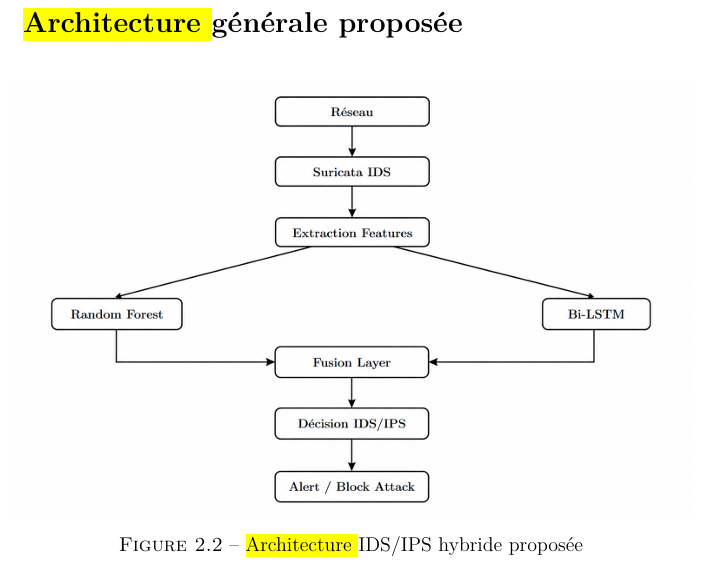
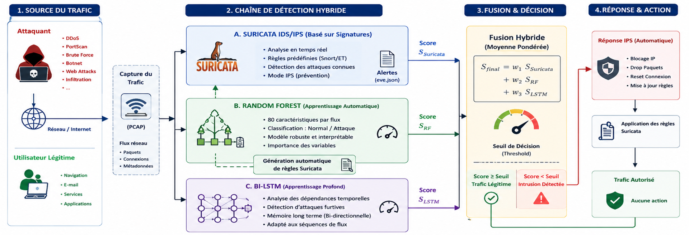

# Hybrid Intelligent IDS/IPS for Cyberattack Detection

## Overview

This project presents a hybrid Intrusion Detection and Prevention System (IDS/IPS) that combines traditional signature-based detection with Machine Learning and Deep Learning techniques.

The system integrates:

- Suricata for network monitoring and rule-based detection
- Random Forest for network traffic classification
- Bidirectional LSTM for temporal pattern analysis
- Hybrid decision fusion
- Automatic Suricata rule generation

## Architecture
### General Architecture

### Detailed Architecture

## Technologies

- Python
- Suricata
- Random Forest
- Bidirectional LSTM
- Scikit-learn
- TensorFlow / Keras
- Linux
- CICIDS2017 Dataset

## Results

The system achieved:

- F1-Score: > 98%
- False Positive Rate: < 2%
## Key Features
-Network traffic monitoring with Suricata

-Signature-based intrusion detection

-Machine Learning-based traffic classification

-Deep Learning-based temporal pattern analysis

-Hybrid decision fusion

-Automatic Suricata rule generation

-Evaluation using the CICIDS2017 dataset
## Future Improvements
Possible future improvements include:

Real-time deployment on live network traffic

Additional Machine Learning and Deep Learning models

Extended evaluation on additional datasets

Performance optimization for real-time detection

Integration with SOC monitoring and alerting workflows
## Author

Nabil Harir

Cybersecurity & Artificial Intelligence Graduate
