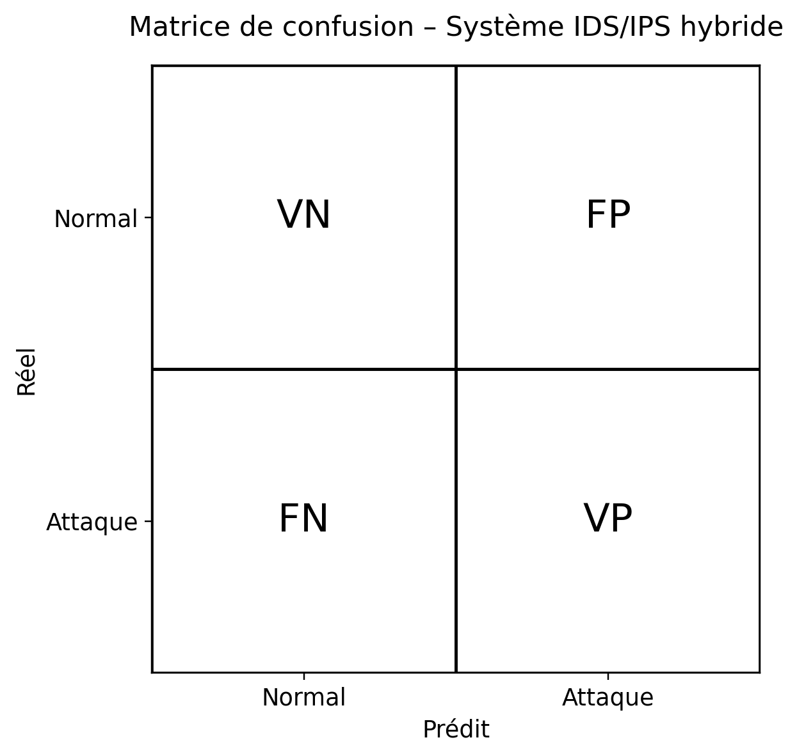
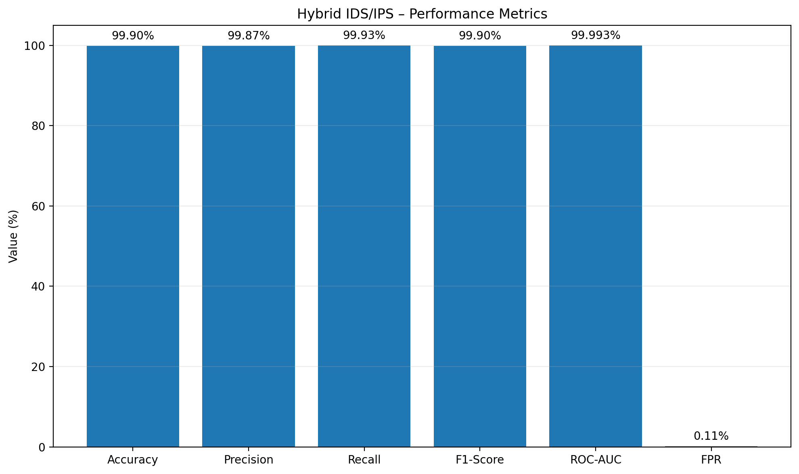
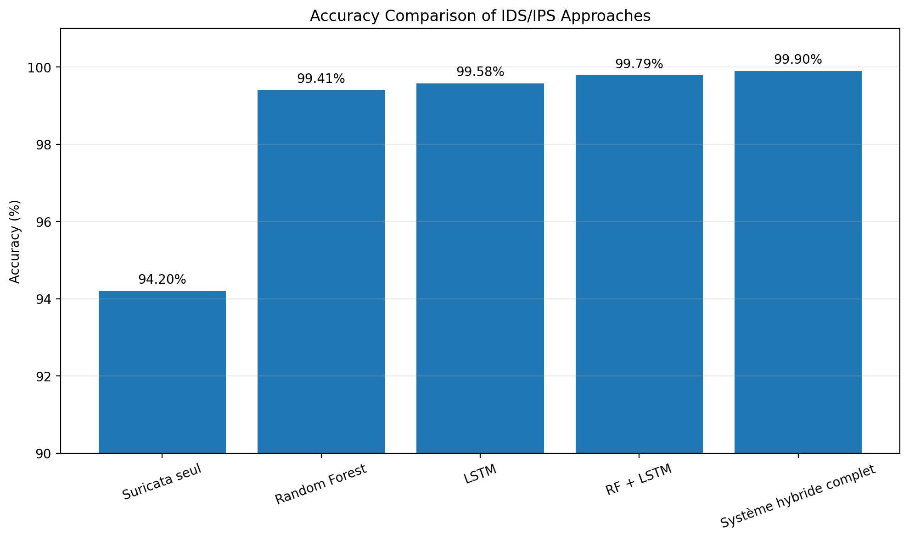

# Evaluation Results

## Dataset

The proposed IDS/IPS system was evaluated using the CICIDS2017 dataset.

## Performance

The evaluation results reported in the project include:

- F1-Score: >98%
- False Positive Rate: <2%

## Models

The hybrid approach combines:

- Suricata
- Random Forest
- Bidirectional LSTM
- Hybrid Decision Fusion

## Confusion Matrix

## Performance

## Model Comparison

